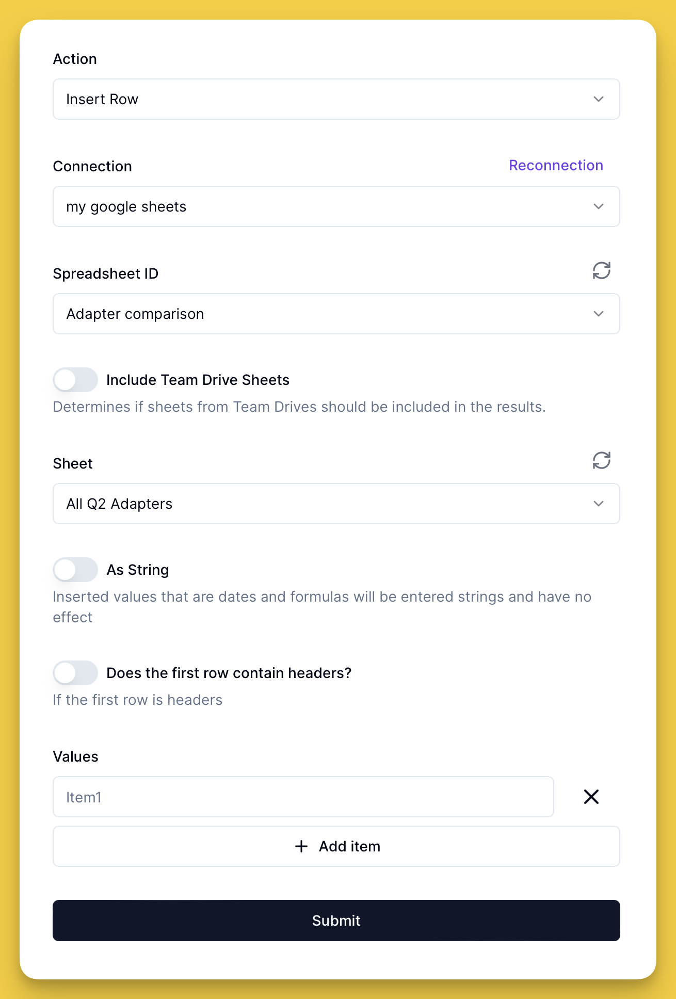

# Fango: Forms for Nango

This library provides UI for Nango and makes it easier to integrate it into your Next.js project.

[nango](https://www.nango.dev) x [shadcn/ui](https://ui.shadcn.com):



## Getting started

`pnpm i @fango/client @fango/server @fango/form`

## Usage

```ts
import { fangoClient } from '@fango/client'
import { fangoServer } from '@fango/server'
import { FangoForm } from '@fango/form'

const fangoClient = new FangoClient(NANGO_HOST!, NEXT_PUBLIC_NANGO_PUBLIC_KEY!)
const fangoServer = new FangoServer(NANGO_HOST, NANGO_SECRET_KEY)

// server-side: set up sync for connections (db calls etc)
fangoServer.setConnectionDatabase({
  getConnection: (id: string) => Connection,
  getConnections: (...) => Connection[]
  createConnection: (...) => Connection,
  updateConnection: (...) => Connection,
  deleteConnection: (...) => void
})

// server-side: calling the APIs, can be used to verify auth
// (in Next would be API routes or server actions)
fangoClient.setServerActions('google-sheets', {
  // 'use server'
  findSpreadsheetsAction: (data) => {
    // optionally check permissions etc
    return fangoServer.findSpreadsheets(data)
  }
})

// client-side: will render form for specific integration 
<FangoForm 
  fangoClient={fangoClient} 
  type='google-sheets'
  /* can do something with the form values */
  onSubmit={(connectionConfig) => save(connectionConfig)} 
/>

// server-side: run actions when needed
fangoServer.run({
  connectionId: 'somestring', 
  type: 'google-sheets', 
  action: 'insert-row', 
  payload: object
})
```

## Playground example in Next.js

See working example in `/playground`. 

Steps to run:
- Clone the repository and `cd playground`
- run `pnpm i`
- Add `.env` file with `NANGO_HOST`, `NANGO_SECRET_KEY` and `NEXT_PUBLIC_NANGO_PUBLIC_KEY`.
- run `pnpm dev`.
- go to `http://localhost:8888`.

## Contributing

Contributions are welcome. To start the development, make sure to also build the packages with `pnpm build`.

